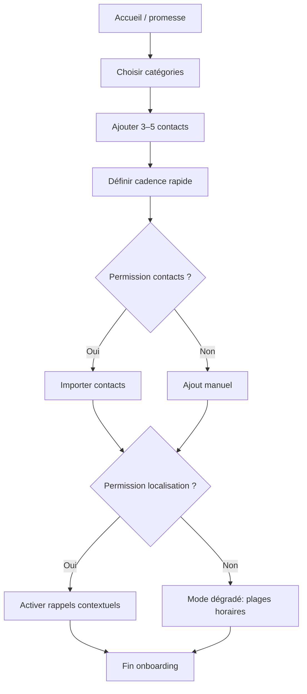
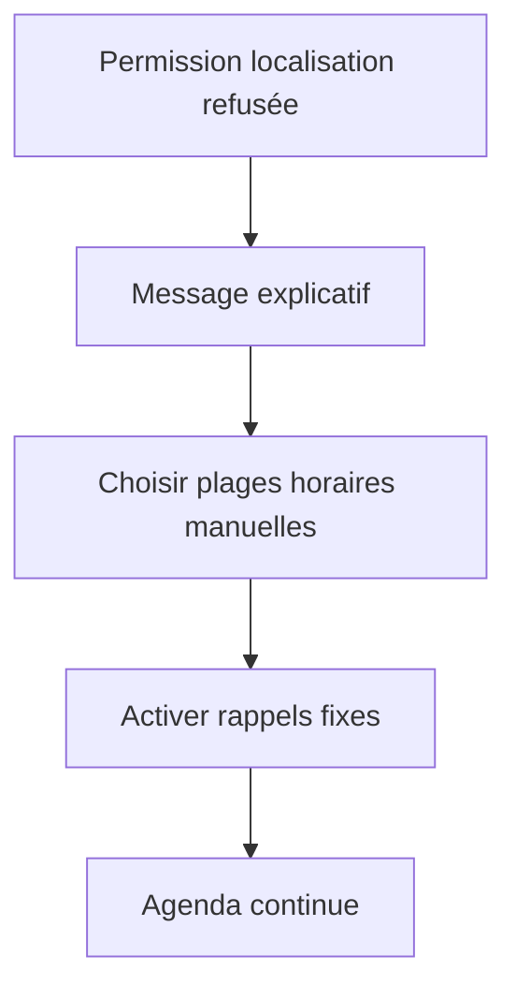

# UX Design Specification projet_flutter_famille

**Author:** Fabricekayo
**Date:** 2026-01-25T06:21:15+01:00

---

<!-- UX design content will be appended sequentially through collaborative workflow steps -->


## Executive Summary

### Project Vision
Créer une application mobile qui enlève l’incertitude et l’oubli autour des contacts familiaux. L’app rend visible “qui je n’ai pas contacté depuis longtemps” et propose le bon moment pour relancer, sans effort ni culpabilité.

### Target Users
Jeunes adultes actifs, à l’aise avec la tech mais exigeants sur la simplicité. Ils veulent un outil minimaliste qui les aide à maintenir un lien familial sans avoir à tout planifier mentalement.

### Key Design Challenges
- Rendre visible “le dernier contact” sans créer de charge mentale supplémentaire.
- Suggérer des moments de contact pertinents sans être intrusif.
- Permettre une organisation claire des contacts (type agenda relationnel) sans complexité.

### Design Opportunities
- Une vue “agenda relationnel” simple qui montre qui contacter et quand.
- Des rappels contextuels légers (soirée, transports) avec ton chaleureux.
- Une expérience ultra-minimaliste qui valorise la fierté et l’apaisement après l’action.


## Core User Experience

### Defining Experience
L’expérience cœur repose sur une notification au bon moment qui permet, en un geste, d’écrire ou d’appeler un proche. L’utilisateur ne “gère” pas l’app : il répond simplement à une impulsion claire et utile.

### Platform Strategy
Mobile uniquement (iOS/Android), pensée pour un usage rapide, tactile et contextuel. Un mode hors‑ligne minimal est attendu pour que les rappels restent utiles même sans réseau.

### Effortless Interactions
- Écrire ou appeler directement depuis la notification, sans navigation.
- Recevoir des rappels automatiquement, sans configuration lourde.
- Voir immédiatement qui n’a pas été contacté depuis longtemps.

### Critical Success Moments
- Le moment “waouh” : l’utilisateur réalise qu’il a gardé le lien avec tous ses proches sans effort conscient.
- Le point d’échec : des rappels insuffisants ou mal synchronisés qui font retomber la régularité des contacts.

### Experience Principles
- **Un geste suffit** : chaque rappel doit se convertir en action en un tap.
- **Contexte discret, jamais intrusif** : aider sans envahir.
- **Rythme qui crée la fierté** : l’utilisateur se sent régulier et apaisé.
- **Automatisation silencieuse** : l’app fait le travail invisible.


## Desired Emotional Response

### Primary Emotional Goals
- Un sentiment de fierté après chaque contact.
- Un état d’apaisement : “je suis à jour, tout va bien”.
- Un sentiment de lien réel, simple, chaleureux.

### Emotional Journey Mapping
- **Découverte** : curiosité / intérêt calme (pas d’effet waouh forcé).
- **Pendant l’action** : geste naturel, léger enthousiasme, effort minimal.
- **Après l’action** : fierté + soulagement.
- **Si le rappel arrive au mauvais moment** : pas de frustration, juste “ok, j’y pense plus tard”.

### Micro-Emotions
- Apaisement
- Fierté
- Sentiment de lien
- Soulagement

### Design Implications
- Rappels discrets et non intrusifs pour préserver l’apaisement.
- Action en un geste pour renforcer la fierté immédiate.
- Ton chaleureux et neutre pour garder l’usage “normal” et quotidien.
- Option “plus tard” visible pour éviter la culpabilité.

### Emotional Design Principles
- **Rituel léger** : l’usage doit devenir naturel, pas émotionnellement lourd.
- **Fierté tranquille** : micro‑victoires répétées plutôt qu’un grand succès.
- **Soutien sans pression** : accompagner, jamais juger.


## UX Pattern Analysis & Inspiration

### Inspiring Products Analysis
- **Tinder** : UX très épurée, actions claires et immédiates, peu de friction. L’interface guide l’action principale sans distraire.
- **Calendrier iPhone** : simplicité visuelle, hiérarchie nette, informations essentielles visibles d’un coup d’œil.

Ce qui crée l’attachement : une expérience fluide, claire, sans surcharge cognitive.

### Transferable UX Patterns
- **Minimalisme fonctionnel** : montrer l’essentiel, masquer le reste.
- **Action principale évidente** : un geste central, immédiatement accessible.
- **Hiérarchie visuelle nette** : ce qui compte ressort sans effort.

### Anti-Patterns to Avoid
- Écrans surchargés d’informations.
- Trop de choix visibles en même temps.
- Complexité inutile qui casse l’habitude.

### Design Inspiration Strategy
**À adopter :**
- Minimalisme et clarté de Tinder / Calendrier.
- Une action centrale toujours accessible.

**À adapter :**
- Les patterns “simple mais guidé” pour un contexte émotionnel (fierté + apaisement).

**À éviter :**
- Toute surcharge visuelle ou cognitive qui casse le rituel léger.


## Design System Foundation

### 1.1 Design System Choice
Adopter **Material Design (Flutter)** comme fondation principale.

### Rationale for Selection
- **Équilibre vitesse/qualité** : composants stables et rapides à livrer.
- **Équipe design faible** : standards déjà éprouvés, moins de risques UX.
- **Accessibilité intégrée** : bonnes bases par défaut.
- **Adaptation mobile native** : cohérent sur iOS/Android via Flutter.

### Implementation Approach
- Utiliser les composants Material par défaut pour l’ossature (buttons, lists, cards, notifications).
- Garder l’architecture UI simple et modulaire pour itérer vite.

### Customization Strategy
- **Minimalisme** : réduire la densité visuelle, limiter les couleurs.
- **Ton doux** : palette calme, contrastes lisibles, espaces aérés.
- **Signature subtile** : un style typographique et une hiérarchie claire pour différencier sans complexité.


## 2. Core User Experience

### 2.1 Defining Experience
L’expérience définissante est une notification intelligente qui suggère d’écrire ou d’appeler un proche *au bon moment*, en rappelant depuis combien de temps le contact n’a pas eu lieu (ex. deux semaines, deux mois).

### 2.2 User Mental Model
Aujourd’hui, les utilisateurs se reposent sur leur mémoire. Ils attendent qu’une app joue le rôle d’agenda relationnel : “rappelle‑moi qui contacter et quand”, sans effort manuel.

### 2.3 Success Criteria
- L’utilisateur sent qu’il a des nouvelles régulières de tous ses proches.
- La notification arrive au bon moment et se transforme en action immédiate.
- L’historique (hebdo/mensuel) reflète que les contacts sont bien répartis.

### 2.4 Novel UX Patterns
Le pattern est **familier (agenda + rappels)**, avec un twist : la notification est contextuelle et “parle” du temps écoulé depuis le dernier contact, ce qui donne du sens à l’action.

### 2.5 Experience Mechanics
**Initiation**  
Déclenchement basé sur la cadence + contexte (moment de la journée, activité, disponibilité, transports/maison, non‑usage du téléphone).

**Interaction**  
Depuis la notification, l’utilisateur choisit **Écrire** ou **Appeler**.

**Feedback**  
L’app lance directement l’expérience native (Messages ou Appel), confirmation implicite.

**Completion**  
Retour simple à l’écran d’accueil, avec mise à jour de l’historique de contact.


## Visual Design Foundation

### Color System
- Palette **calme et douce** : tons neutres clairs, accent doux pour les actions clés.
- Primaires sobres pour préserver l’apaisement et éviter la surcharge.
- Couleurs d’état (succès/alerte) discrètes, jamais agressives.

### Typography System
- Typographie **humaine, très simple** : lisibilité maximale, ton chaleureux.
- Hiérarchie claire (titres sobres, corps confortable) pour un usage rapide.

### Spacing & Layout Foundation
- Interface **aérée** pour réduire la charge mentale.
- Rythme **8px** (aligné Material) pour cohérence et simplicité.
- Espacements généreux autour des actions principales.

### Accessibility Considerations
- Contrastes **standards** conformes Material.
- Tailles de texte confortables pour lecture rapide.


## Design Direction Decision

### Design Directions Explored
6 directions visuelles ont été explorées (minimal, focus, soft, warm, timeline, agenda). La direction “Agenda Lite” s’aligne le mieux avec l’objectif d’un agenda relationnel clair.

### Chosen Direction
**Direction 6 — Agenda Lite**, renforcée par :
- une **vue semaine/mois explicite**
- davantage d’informations contextuelles (dernier contact / prochaine fenêtre)

### Design Rationale
- L’agenda rend visible “qui contacter et quand”.
- La vue temporelle structure le rythme sans surcharge.
- Les infos contextuelles renforcent le sentiment de contrôle et de régularité.

### Implementation Approach
- Layout principal en sections temporelles (Aujourd’hui / Cette semaine / Ce mois‑ci).
- Modules agenda simples (liste + labels temporels).
- Affichage discret du dernier contact et du prochain rappel suggéré.


## User Journey Flows

### 1) Onboarding & Permissions
Objectif : créer l’agenda relationnel et obtenir les permissions utiles.



### 2) Rappel → Action (écrire / appeler)
Objectif : transformer un rappel en action immédiate.

```mermaid
flowchart TD
  A[Notification contextuelle] --> B{Choix utilisateur}
  B -- Écrire --> C[Ouvrir app Messages]
  B -- Appeler --> D[Lancer Appel]
  C --> E[Retour app]
  D --> E
  E --> F[Mise à jour historique + badge "contact fait"]
```

### 3) Permissions refusées → Mode dégradé
Objectif : maintenir l’utilité sans localisation.



### Journey Patterns
- **Entrée claire** : promesse → choix simple → action.
- **Raccourci d’action** : notification → action en 1 tap.
- **Fallback gracieux** : mode dégradé sans culpabilité.

### Flow Optimization Principles
- Minimiser les étapes avant la première valeur.
- Toujours proposer une alternative si permission refusée.
- Boucler l’action avec un feedback immédiat (historique/confirmation).


## Component Strategy

### Design System Components
- Buttons, Lists, Cards
- Chips/Tags (cadence, statut)
- Bottom sheets / Dialogs
- Tabs/Segmented (Aujourd’hui / Semaine / Mois)

### Custom Components

#### Agenda Section
**Purpose:** Structurer l’agenda par périodes (Aujourd’hui / Semaine / Mois)  
**Usage:** Page d’accueil principale  
**States:** vide / rempli / focus  
**Accessibility:** titres de section lisibles, éléments listés

#### Contact Card
**Purpose:** Afficher un proche + “dernier contact” + actions  
**Usage:** Liste agenda  
**States:** normal / action effectuée / inactif  
**Actions:** Écrire / Appeler / Plus tard

#### Reminder Banner
**Purpose:** Mettre en avant la suggestion du moment  
**Usage:** Haut de l’écran agenda  
**States:** suggestion / ignoré / complété

#### History Mini‑log
**Purpose:** Résumer les actions de la semaine  
**Usage:** Bas de page  
**States:** vide / rempli

#### Permission Explainer
**Purpose:** Expliquer la valeur des permissions  
**Usage:** Onboarding  
**States:** demandé / refusé / accepté

### Component Implementation Strategy
- Construire les composants custom à partir des tokens Material.
- Réutiliser la même hiérarchie visuelle (titres → actions → contextes).
- Accessibilité par défaut (contraste, tailles, clarté).

### Implementation Roadmap
**Phase 1 (cœur)**  
1. Agenda Section  
2. Contact Card  

**Phase 2 (expérience)**  
3. Reminder Banner  
4. History Mini‑log  

**Phase 3 (support)**  
5. Permission Explainer


## UX Consistency Patterns

### Button Hierarchy
**When to Use:** actions principales (Écrire/Appeler), secondaires (Plus tard), tertiaires (Modifier).  
**Visual Design:** primaire plein, secondaire contour, tertiaire texte.  
**Behavior:** une action principale par écran.  
**Accessibility:** tailles confortables, labels explicites.  
**Mobile:** zones tactiles larges.

### Feedback Patterns
**When to Use:** action réussie, permission refusée, rappel planifié.  
**Visual Design:** feedback discret (toast/snackbar doux).  
**Behavior:** confirmation implicite après action + badge “contact fait”.  
**Accessibility:** messages lisibles, contrastes standards.  
**Mobile:** durées courtes, non intrusif.

### Form Patterns
**When to Use:** ajout contact, cadence, plages horaires.  
**Visual Design:** champs courts, choix en chips/toggles.  
**Behavior:** validations inline simples.  
**Accessibility:** labels visibles, erreurs claires.  
**Mobile:** saisie minimale.

### Navigation Patterns
**When to Use:** navigation principale par onglets (Aujourd’hui/Semaine/Mois).  
**Visual Design:** tabs en haut + CTA visible.  
**Behavior:** retour systématique à l’agenda après action.  
**Mobile:** navigation à une main.

### Empty & Loading States
**When to Use:** aucun contact, historique vide, première utilisation.  
**Visual Design:** messages chaleureux, CTA unique.  
**Behavior:** guider vers l’ajout de proches.  
**Accessibility:** texte clair, icônes non essentielles.

### Search & Filtering Patterns
**When to Use:** grands volumes de contacts.  
**Visual Design:** recherche simple + filtres par catégorie.  
**Behavior:** résultats instantanés, filtres persistants.  
**Accessibility:** champs accessibles, focus visible.


## Responsive Design & Accessibility

### Responsive Strategy
- **Mobile‑only** : expérience optimisée pour téléphone.
- Mise en page unique, pensée pour usage à une main.

### Breakpoint Strategy
- **Mobile uniquement** (pas de tablette/desktop à ce stade).
- Focus sur petites et moyennes tailles d’écran.

### Accessibility Strategy
- **WCAG AA** comme standard.
- Contrastes lisibles, tailles de texte confortables.
- Touch targets ≥ 44px.

### Testing Strategy
- Tests essentiels sur 2–3 tailles d’écran.
- Vérification VoiceOver / TalkBack basique.
- Contraste et lisibilité en conditions normales.

### Implementation Guidelines
- Design mobile‑first.
- Utiliser composants Material accessibles par défaut.
- Garder textes courts et actions claires.


## Design Assets & References

### Canonical Locations
- Maquettes Figma (source actuelle) : `_bmad-output/planning-artifacts/image-figma/`
- Maquettes hi-fi (structure recommandée) : `_bmad-output/planning-artifacts/designs/hifi/`
- Wireframes (à venir) : `_bmad-output/planning-artifacts/designs/wireframes/`

### Linked Screens (Hi-Fi)
- Accueil (version carte suggestion) : `_bmad-output/planning-artifacts/designs/hifi/home.png`
- Accueil (version liste + toast) : `_bmad-output/planning-artifacts/designs/hifi/home-alt.png`
- Proches : `_bmad-output/planning-artifacts/designs/hifi/contacts.png`
- Réglages : `_bmad-output/planning-artifacts/designs/hifi/settings.png`
- Modifier le contact : `_bmad-output/planning-artifacts/designs/hifi/contact-edit.png`
- Fiche contact : `_bmad-output/planning-artifacts/designs/hifi/contact-detail.png`

### Linked Screens (Hi-Fi Onboarding)
- Onboarding 01 — Welcome : `_bmad-output/planning-artifacts/designs/hifi/onboarding-01-welcome.png`
- Onboarding 02 — Cercles : `_bmad-output/planning-artifacts/designs/hifi/onboarding-02-circles.png`
- Onboarding 03 — Premiers contacts : `_bmad-output/planning-artifacts/designs/hifi/onboarding-03-first-contacts.png`
- Onboarding 04 — Cadence : `_bmad-output/planning-artifacts/designs/hifi/onboarding-04-cadence.png`
- Onboarding 05 — Import contacts : `_bmad-output/planning-artifacts/designs/hifi/onboarding-05-contacts-import.png`
- Onboarding 06 — Localisation : `_bmad-output/planning-artifacts/designs/hifi/onboarding-06-location.png`
- Onboarding 06b — Disponibilités : `_bmad-output/planning-artifacts/designs/hifi/onboarding-06b-availability.png`
- Onboarding 07 — Prêt : `_bmad-output/planning-artifacts/designs/hifi/onboarding-07-ready.png`

## Onboarding Flow (Proposition Canonique)

### Objectif Produit
- Mettre l’utilisateur en réussite en moins de quelques écrans.
- Créer un premier “agenda relationnel” crédible dès la fin du flux.
- Réduire la friction permissions en expliquant clairement la valeur.

### Séquence Recommandée
1. Welcome : poser la promesse et un seul CTA (“Commencer”).
2. Cercles : sélectionner les groupes importants (modifiable plus tard).
3. Premiers contacts : saisir 1 à 3 proches minimum.
4. Cadence : choisir une cadence par défaut simple.
5. Import contacts : proposer l’accélérateur au bon moment.
6. Localisation OU Disponibilités : offrir un chemin clair sans permission.
7. Ready : confirmer et rediriger vers l’Agenda.

### Règles UX Clés
- Toujours proposer une sortie “sans permission” (ex: “Choisir des horaires fixes”).
- Expliquer la raison derrière chaque permission en une phrase.
- Garder une seule action principale par écran.
- Pré-remplir et simplifier au maximum (valeurs par défaut raisonnables).

### Mapping Écrans → Fichiers
- Step 01 — Welcome : `_bmad-output/planning-artifacts/designs/hifi/onboarding-01-welcome.png`
- Step 02 — Cercles : `_bmad-output/planning-artifacts/designs/hifi/onboarding-02-circles.png`
- Step 03 — Premiers contacts : `_bmad-output/planning-artifacts/designs/hifi/onboarding-03-first-contacts.png`
- Step 04 — Cadence : `_bmad-output/planning-artifacts/designs/hifi/onboarding-04-cadence.png`
- Step 05 — Import contacts : `_bmad-output/planning-artifacts/designs/hifi/onboarding-05-contacts-import.png`
- Step 06a — Localisation : `_bmad-output/planning-artifacts/designs/hifi/onboarding-06-location.png`
- Step 06b — Disponibilités (sans localisation) : `_bmad-output/planning-artifacts/designs/hifi/onboarding-06b-availability.png`
- Step 07 — Prêt : `_bmad-output/planning-artifacts/designs/hifi/onboarding-07-ready.png`

### Usage Guidance (BMAD)
- Cette spécification UX (`ux-design-specification.md`) est la référence canonique : on lie ici les visuels utilisés pour guider l’implémentation.
- Les assets restent côté planning (pas dans le code) ; le code Flutter reconstruit l’UI en widgets.
